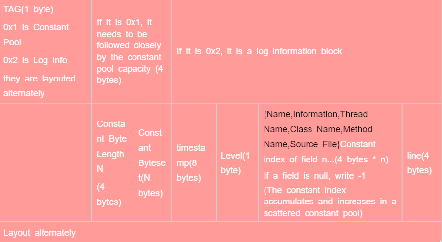

# Introduction
RapidLogging is a logging system in the Rapid application development framework, 
which has features such as cross-platform, high-performance, low hard disk usage, support for coloring, and support for multiple processes

# Implementation
## Format
RapidLogging stores logs in bytecode format, dividing the bytecode into two parts: constant pool and log information
## Bytecode Layout
Considering that logs are append written, it is inconvenient to place constant pools uniformly at the beginning. 
Therefore, a method of alternating constant pool and log information writing is adopted, which is a scattered constant pool.
When establishing the output stream, the existing constants are first read into memory. 
When outputting log information, the constants are extracted and placed in the constant pool,
and a new constant string is written together with the log information. 
If constants can be used in the log information, the ID of the constant is directly-used instead. 
This process repeats back and forth, forming a bytecode format where log information and constant pool alternate side by side
## Structure
### General Structure

### Log Block Structure

