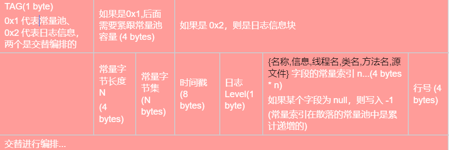

# 介绍
RapidLogging是Rapid应用开发框架中的一个日志系统， 其具有跨平台、高性能、低硬盘占用、支持染色、支持多进程等特性

# 具体实现
## 格式
RapidLogging 以字节码格式存储日志，将字节码分为两个部分：常量池和日志信息
## 字节码编排
考虑到日志是追加写入的，所以常量池如果统一放在开头比较麻烦，所以采用常量池和日志信息交替写入的方式，即散落式常量池。
当建立输出流时，先将已有常量读取进内存，输出日志信息时，将常量抽取放入常量池，并且将新的常量串与日志信息一并写入，
后续如果日志信息中可以使用常量，则直接使用常量的ID代替，如此往复，形成一种日志信息与常量池交替式并排的字节码格式
## 结构图
### 总体结构

### 日志编排区结构

